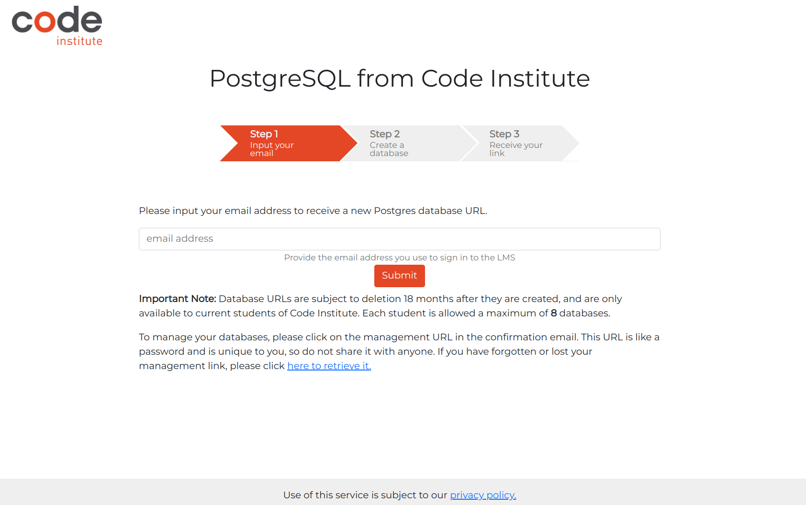
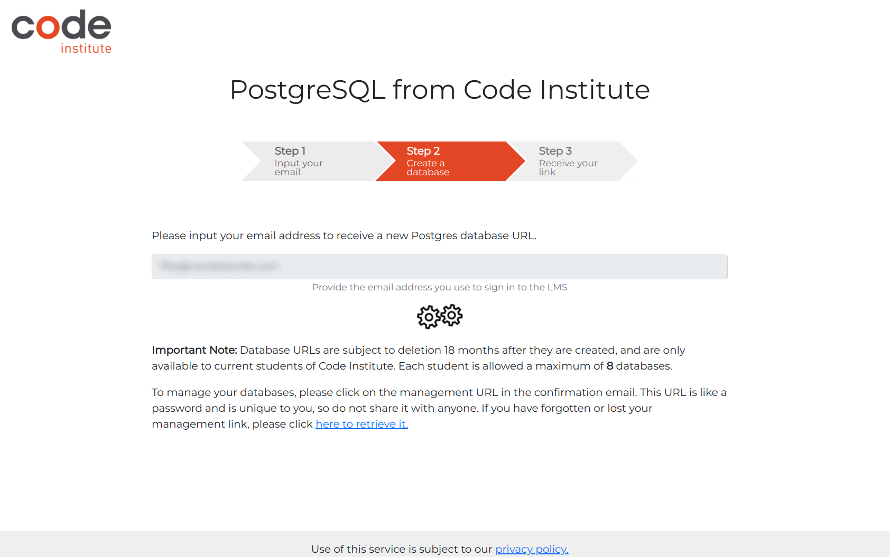
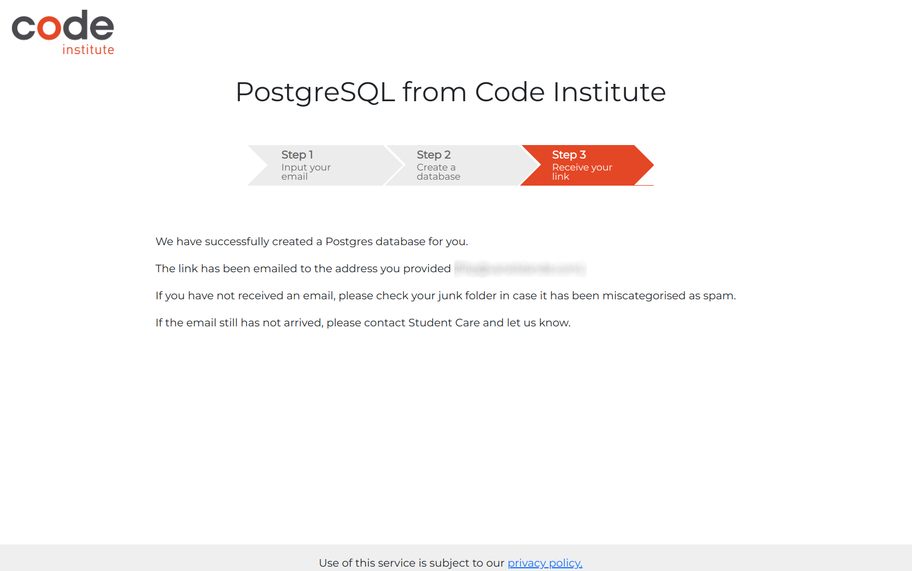
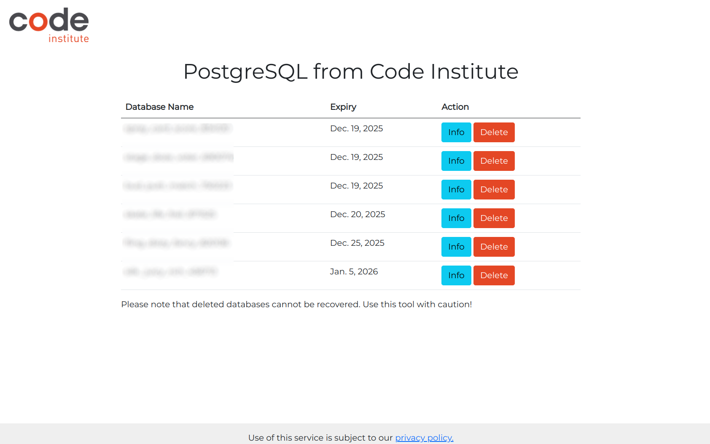

Simple - Blog / Mockup plaatje / Live Link

Table of contents

- [UX](#ux)

  - [Agile User Stories/Epics/Milestones](#agile-user-stories)
  - [Site Goals](#site-goals)
  - [Wireframes](#wireframes)
  - [Images](#images)
  - [Logo](#logo)
  - [Favicon](favicon)
  - [Colour Scheme](colour-scheme)
  - [Fonts](fonts)
  - [Databases](databases)
  - [Features](Features)
  - [Bugs](bugs)
  - [Testing](testing)
  - [Deployment](deployment)
  - [Credits](credits)

# UX

## Agile User Stories/Epics/Milestone

## Site Goals

Lorem ipsum dolor sit amet. Sed galisum praesentium est quia voluptatum ut quaerat voluptatem qui quod eligendi et obcaecati illum. Qui enim quia qui laboriosam incidunt aut natus doloremque ut eveniet nihil! Et consequatur quam aut tenetur adipisci ea illum voluptatum hic deserunt consequuntur est obcaecati dolorum aut optio cupiditate et alias nobis.

A dolore praesentium ea officia sequi est quos soluta ea magni veniam? Aut doloribus commodi qui tempore officia et totam temporibus quo quod error sed beatae eligendi et nihil rerum.

## User Stories

As a user I want:

- Lorem ipsum dolor sit amet. Sit quibusdam voluptates vel iusto dolorem qui aliquid Quis a incidunt explicabo ab neque dolorum sed libero.
- Vel laudantium praesentium aut provident laudantium et ducimus dolor ea magni similique.
- To be able to set a Cipher-Key, this is a handy feature to add a extra level of complexity to obscure your passwords.
- To set up a default user login, makes the UX more user friendly.
- To always be able to change the 'master password' to access the password-manager.
- **note** There was a **copy/paste** password clipboard feature available but that I need to removed because it was not possible to integrate that
  in Heroku cloud environment.

As the administrator I want:

-  Est odio quia At repellat velit ut corporis quae ut consequatur fugiat non magnam libero id odit iste est voluptatibus libero.
- Quis a incidunt explicabo ab neque dolorum sed libero

## Deployment

### Heroku Deployment
This site was deployed to and is currently [hosted on the Heroku platform](https://mysimpleblog-1c6e9d449421.herokuapp.com/). The steps for deploying to Heroku, using PostgreSQL as the database host, are as follows:

#### Create a new PostgreSQL Code Institute database.

From codeinstitute every student can maintain up to eight databases to run there projects. Here is a step by step guide to install PostgreSQL from Code Institute to the clould!

  1. Navigate to [PostgreSQL from Code Institute](https://dbs.ci-dbs.net//) and log in with your LMS account
  

  2. After you filled in your LMS account the PostgresSQL database manager will automaticly generate a new database for you.
  

  3. You now have a brand new PostgreSQL Code Institute database
  The link to this database and how to manage all your other databases will be send my email. 
  
  4. Do note these databases are limted in time and have a life time of operation of 18 months after the date of creation.
  
 
#### Deploy the project challenge
  In the previous topic, I have created a PostgreSQL database. In this topic, you are challenged to deploy your project to Heroku.
  First you go to the Heroku website and login whit your credentials. 
  
  Part 1 - Create the Heroku app:
  1. Navigate to your Heroku dashboard and create a new app with a unique name in a GPDR region Europe 
  Note: No Django static file collection will be required during the build.
  2. In your new app’s settings tab, ensure the Config Var **DISABLE_COLLECTSTATIC** key has a value of **1**.

  Part 2 - Update your code for deployment:

  1. Use **pip3** to install ```gunicorn~=20.1``` and **freeze** it to the **requirements.txt** file.
  The commands at the terminal are:

    pip3 install gunicorn~=20.1 
    pip3 freeze --local > requirements.txt

  2. In the **Procfile**, add a command using **gunicorn** and **myblog wsgi** file to start the webserver.

  3. In the **myblog/settings.py** file, set the **DEBUG** constant to False and append the **'.herokuapp.com'** hostname to the **ALLOWED_HOSTS** list. 
  
    web: gunicorn myblog.wsgi

  **Note:** There is a space after the colon.
  **Note:** The Procfile has no file extension.

  **Top tip!** It's a good habit to always set **DEBUG** to **False** before any deployment. Once you have completed deployment, you can set it back to True locally to continue development.
  **Double check**
    Have you changed DEBUG to False and added , **'.herokuapp.com'** to the **ALLOWED_HOSTS**?
      
      DEBUG = False
      ,'.herokuapp.com'
  

  4. Git add, commit and push the code to your GitHub repo.

    git add .
    git commit -m "readies code for deploy"
    git push origin main


Part 3 - Deploy to Heroku:

  1. In your new app’s **Deploy** tab, search for your GitHub repo and connect it to the Heroku app. Manually deploy the **main** branch of this GitHub repo.
  **Note:** Start typing your project repo name into the search box and click on the GitHub repo you want to deploy from.
  After manually deploying the main branch, you can view the build output in the application’s **Activity** tab in the dashboard.

  In your new app’s resources tab, ensure you are using an eco dyno and delete any Postgres database Add-on.
  2. Click **Open app** buttin o see your deployed app. If everythings goes well you on the frontpage of myblog.

  Note: The build must be complete before you can open the app.
  Note: You will see an error that the current path didn’t match any of the URL patterns as you have not written the urlpattern yet.


## Credits

### w3 schools

> Used to reference Python Structure

### Stack Overflow

> Used to reference different syntax issues from existing older boards. Also used to query clear function issues when I ran into them as referenced in the bug section.

## Acknowledgements

### Daisy McGirr

- My Mentor with Code Institute who has provided me with excellent feedback and guidance through this project.